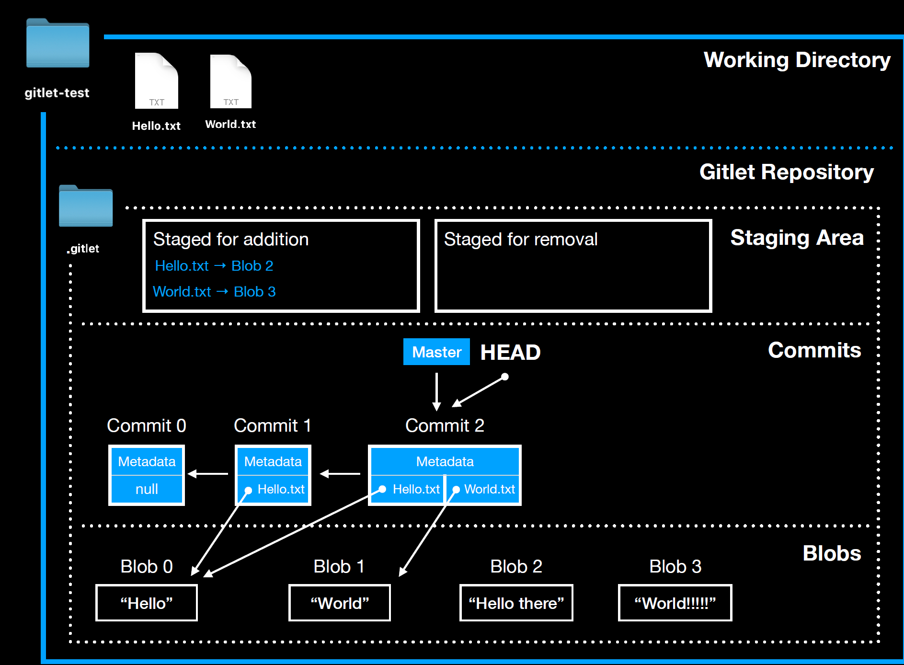
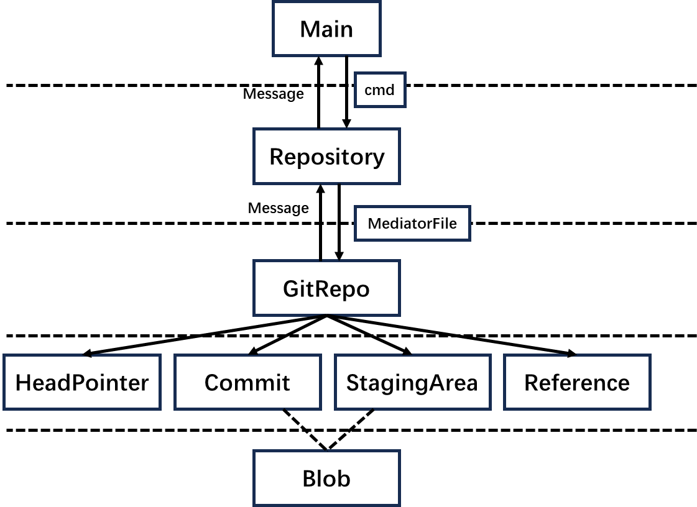

# CS61B-SP21 Proj2 Gitlet

## This is my implementation of the second project in CS61B-SP21: Gitlet

In this program, we will implement a mini git which named 'gitlet'.
[Here](https://sp21.datastructur.es/materials/proj/proj2/proj2) is the spec of this project which contains the demands, including the difference with the real git.

Here is the [video](https://youtu.be/fvhqn5PeU_Q?si=FjeSkGEZry1Cbiky) you need to view before starting this project which covers the key points of this project.

## Project Structure

Below is the structure of the entire Gitlet project, which we can obtain from the explanatory video above.

Then comes the abstract structure of this project (which focuses on abstraction).

| class        | desc                                                         |
| ------------ | ------------------------------------------------------------ |
| Main         | receive and validate the cmd, and call the method of the repository |
| Repository   | represents the entire directory of the project, and call the method of the GitRepo and manage all files in the working directory |
| GitRepo      | represents the `.gitlet/` directory and manage the file in the `.gitlet/`. This class can call the method of HeadPointer, Commit, StagingArea and Reference. |
| HeadPointer  | represents the head pointer, and manage the .gitlet/HEAD file, this class only support the class method to absract the HEAD file and manipulate the head pointer directly and can not be instantiated. |
| Commit       | represents the commit directory and manage all commit instances. |
| Staging Area | represents the staging area, including the `staged for addition` and `staged for removal`, this class also only support the class method to add some file to staged area or removed area but can not be instantiated. |
| Reference    | represents the references of each branch, this class also can not be instantiated. |
| Blob         | manage all blob file and instances.                          |

There are some key points as follows:

1. Main only receive and validate the cmd, pass the cmd to the Repository which returns the message to print. Main cannot execute the cmd
2. Repository also call the method of GitRepo which returns the message to print, and manage(create, delete, write) the file in the working directory.
3. GitRepo is the one actually executing the command line by call the method of the HeadPointer, Commit, Staging Area, Reference, but it can not change the file in the working directory directly
4. Files in working directory are passed between Repository and GitRepo through `MediatorFile`.(GitRepo cannot access the file in working directory directly, so wrap the File into the MediatorFile), and the files to delete or write is passed by the List class as the param.
5. Commit and StagingArea are considered as contains the entire content of the file, but in practice they maintain the map from the file name to blob file which is the one actually save the content of the file. This is for avoiding the redundancy(You can see this in the provided video).
6. GitRepo cannot access the Blob class, only Commit and StagingArea can call the method of blob and expose the interface to get the file content.

​	In general, this project mainly tests our ability to abstract: how to divide various functions reasonably and not violate the abstraction barrier. Here, based on the structure of Gitlet, I divided each file into a class to manage all corresponding files.

​	In the concept we proposed, Commit and StagingArea should contain all the content of the files. However, this approach leads to a lot of redundancy. Blob is introduced to avoid redundancy. Therefore, in designing the abstract structure, we still abstract Commit and StagingArea as classes containing the entire content. However, at the lower level, there is a mapping maintained with Blob.

## Environment

| depedency | version |
| --------- | ------- |
| jdk       | 11      |

## Known issues

I have not implemented the gitlet remote command which is the extra points.
